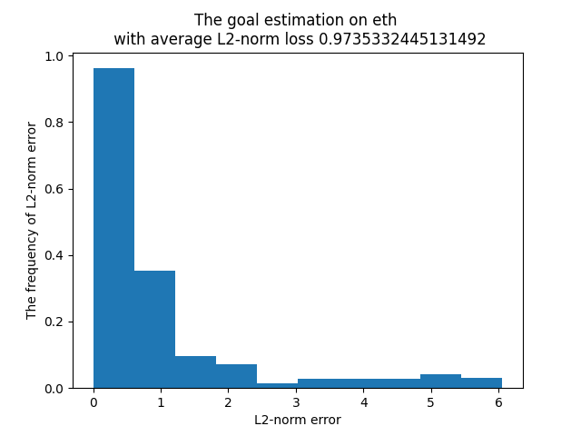
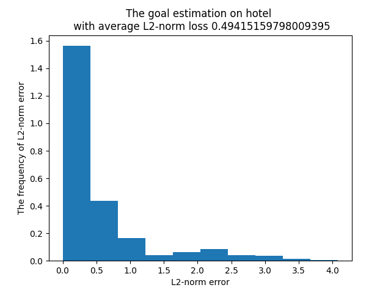
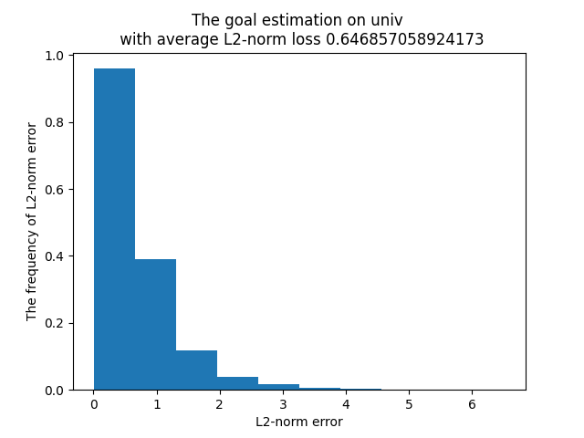
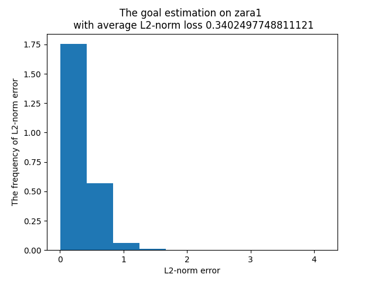
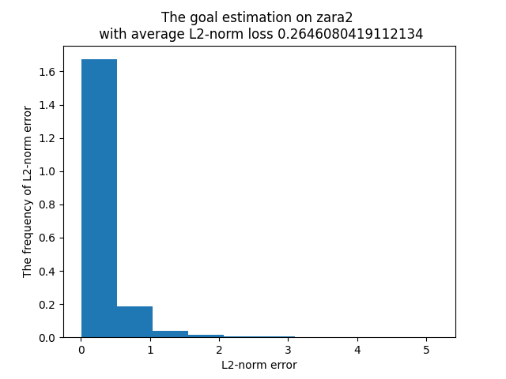

# Goal-Estimator
For research use only

The goal estimator is from this paper:
```bibtex
@inproceedings{he2021where,
  title={Where are you heading? Dynamic Trajectory Prediction with Expert Goal Examples},
  author={He, Zhao and Richard P. Wildes},
  booktitle = {Proceedings of the International Conference on Computer Vision (ICCV)},
  month = {Oct.},
  year={2021}
}
```
The histogram of this goal estimator on ETH/UCY dataset is shown as follows:

</img>
</img>
</img>
</img>
</img>

The Final Displacement Error is shown as follows:


| **Dataset**                           | **FDE(L2 norm between predicted goals and ground truth goals)** |
| --------------------------------- | ------- |
| **ETH**                     | 0.9735   |
| **HOTEL**                     | 0.4942   |
| **ZARA1**                     | 0.3402   |
| **ZARA2**                     |  0.2646  |
| **UNIV**                     | 0.6469   |
